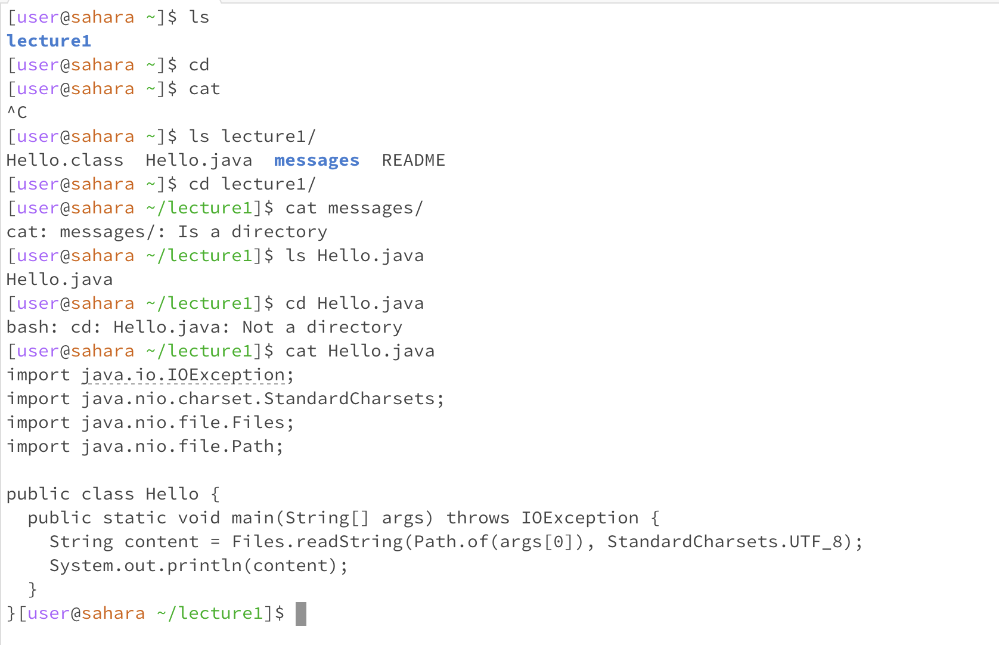

# Lab Report 1 - Remote Access and FileSystem

1. After `ls`, we are in `/home`.
  `ls` will show the current working directory.
  It's not an error.

2. After `cd`, we are in `/home`.
   `cd` with out argument will do nothing and output nothing, so we are still in `/home`.
   It's not an error.

3. After `cat`, we are in `/home`.
   `cd` with out augument will output what ever we input, so there is nothing at first. When we pressing` control + C` to quit cat, it outputs `^C`. It's not an error.

4. After `ls messages/`, we are in `/home`
   `ls messages/` will show the files in the `home/messages` directory. It's not an error.

5. After `cd messages/`, we are in `/home/messages`
  `cd messages/` will change the working directory to `/home/messages` and output nothing. It's not an error.

6. After `cat messages/`, we are in `/home/messages`
  `cat messages/` will output an error because `cat` need to follow an argument that is a file.

7. After `ls Hello.java`, we are in `/home`
     `ls Hello.java` will show the file name of `Hello.java. It's not an error.
8. After `cd Hello.java`, we are in `/home`
     `cd Hello.java` will output an error because cd need to follow an argument that is a directory.
9. After `cat Hello.java`, we are in `/home`
      `cat Hello.java` will output the content in the Hello.java. It's not an error.
